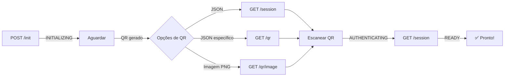

# 🚀 WhatsApp Web.js API

> API REST completa para integração com WhatsApp Web usando Node.js, TypeScript, Express e whatsapp-web.js

[](https://opensource.org/licenses/MIT)
[](https://www.typescriptlang.org/)
[](https://nodejs.org/)

## 📋 Índice

- [Sobre](#sobre)
- [Características](#características)
- [Arquitetura](#arquitetura)
- [Instalação](#instalação)
- [Configuração](#configuração)
- [Uso](#uso)
- [Docker](#-docker)
- [Testes](#-testes)
- [Documentação da API (Swagger)](#-documentação-da-api-swagger)
- [API Endpoints](#api-endpoints)
- [Estrutura do Projeto](#estrutura-do-projeto)
- [Tecnologias](#tecnologias)
- [Contribuindo](#contribuindo)
- [Licença](#licença)

## 🎯 Sobre

Esta API fornece uma interface REST completa para interagir com o WhatsApp Web através da biblioteca `whatsapp-web.js`. Foi construída seguindo os princípios de Clean Architecture, SOLID e boas práticas de desenvolvimento.

## ✨ Características

- 🔐 **Múltiplas sessões**: Gerenciamento de múltiplas sessões simultâneas
- 💬 **Mensagens**: Envio de texto, mídia, localização, enquetes
- 👥 **Grupos**: Criação e gerenciamento completo de grupos
- 📱 **Contatos**: Gerenciamento de contatos e validação de números
- 🎨 **Perfil**: Customização de perfil (nome, status, foto)
- 📊 **Chats**: Gerenciamento de conversas (arquivar, fixar, silenciar)
- 🔄 **Eventos em tempo real**: WebSocket para eventos do WhatsApp
- 🛡️ **Segurança**: Helmet, CORS, validações
- 📝 **Logs**: Sistema de logging com Winston
- 🎯 **TypeScript**: Tipagem forte em todo o projeto
- 🏗️ **Clean Architecture**: Separação de responsabilidades
- ✅ **SOLID**: Princípios de design aplicados

## 🏛️ Arquitetura

O projeto segue a arquitetura em camadas (Clean Architecture):

```
src/
├── config/          # Configurações (env, logger, whatsapp)
├── models/          # Interfaces e tipos TypeScript
├── repositories/    # Camada de acesso a dados
├── services/        # Lógica de negócio
├── controllers/     # Controladores (handlers de requisição)
├── routes/          # Definição de rotas
├── middlewares/     # Middlewares (error handler, async handler)
├── utils/           # Utilitários (validators, formatters, errors)
├── app.ts           # Configuração do Express
└── server.ts        # Inicialização do servidor
```

### Princípios aplicados:

- **Single Responsibility**: Cada classe tem uma única responsabilidade
- **Open/Closed**: Extensível sem modificar código existente
- **Liskov Substitution**: Interfaces bem definidas
- **Interface Segregation**: Interfaces específicas e coesas
- **Dependency Inversion**: Dependências por abstração

## 📦 Instalação

```bash
# Clone o repositório
git clone https://github.com/seu-usuario/api-wwebjs.git

# Entre na pasta
cd api-wwebjs

# Instale as dependências
npm install
```

## ⚙️ Configuração

1. Copie o arquivo de exemplo de variáveis de ambiente:

```bash
cp .env.example .env
```

2. Configure as variáveis de ambiente no arquivo `.env`:

```env
# Server Configuration
PORT=3000
NODE_ENV=development

# API Configuration
API_PREFIX=/api
API_VERSION=v1

# WhatsApp Configuration
SESSION_NAME=default
SESSION_PATH=./sessions
PUPPETEER_HEADLESS=true

# Security
API_KEY=your-secret-api-key-here
ALLOWED_ORIGINS=http://localhost:3000,http://localhost:5173
```

## 🚀 Uso

### Desenvolvimento

```bash
pnpm run dev
```

### Produção

```bash
# Build
pnpm run build

# Start
pnpm start
```

## 🐳 Docker

A maneira mais fácil de executar esta API é usando Docker. O projeto inclui suporte completo para containers com Docker e Docker Compose.

### Pré-requisitos Docker

- Docker 20.10+
- Docker Compose 2.0+

### Início Rápido com Docker

```bash
# 1. Copie o arquivo de ambiente
cp .env.docker .env

# 2. (Opcional) Edite .env com suas configurações
nano .env

# 3. Inicie o container
docker-compose up -d

# 4. Verifique os logs
docker-compose logs -f

# 5. Acesse a API
curl http://localhost:3000/health
```

A API estará disponível em `http://localhost:3000`

### Comandos Docker Úteis

```bash
# Iniciar containers
docker-compose up -d

# Parar containers
docker-compose down

# Ver logs em tempo real
docker-compose logs -f whatsapp-api

# Reiniciar container
docker-compose restart whatsapp-api

# Reconstruir imagem após mudanças no código
docker-compose up -d --build

# Ver status dos containers
docker-compose ps

# Acessar shell do container
docker-compose exec whatsapp-api sh

# Parar e remover volumes (CUIDADO: apaga sessões)
docker-compose down -v
```

### Build Manual da Imagem Docker

```bash
# Build da imagem
docker build -t whatsapp-api:latest .

# Executar container manualmente
docker run -d \
  --name whatsapp-api \
  -p 3000:3000 \
  -e NODE_ENV=production \
  -v whatsapp-sessions:/app/sessions \
  -v whatsapp-logs:/app/logs \
  whatsapp-api:latest
```

### Variáveis de Ambiente Docker

As seguintes variáveis podem ser configuradas no arquivo `.env`:

| Variável | Padrão | Descrição |
|----------|--------|-----------|
| `PORT` | `3000` | Porta do servidor |
| `NODE_ENV` | `production` | Ambiente de execução |
| `SESSION_NAME` | `default` | Nome da sessão padrão |
| `PUPPETEER_HEADLESS` | `true` | Executar Chromium sem interface |
| `API_KEY` | - | Chave de API (⚠️ altere em produção) |
| `ALLOWED_ORIGINS` | `http://localhost:3000` | Origens permitidas (CORS) |
| `LOG_LEVEL` | `info` | Nível de log (error, warn, info, debug) |

### Volumes Persistentes

O Docker Compose cria volumes para persistir dados importantes:

- **whatsapp-sessions**: Dados de autenticação do WhatsApp
- **whatsapp-logs**: Arquivos de log da aplicação
- **whatsapp-uploads**: Arquivos enviados/recebidos

```bash
# Listar volumes
docker volume ls | grep whatsapp

# Inspecionar volume
docker volume inspect whatsapp-sessions

# Backup de volume
docker run --rm -v whatsapp-sessions:/data -v $(pwd):/backup alpine tar czf /backup/sessions-backup.tar.gz /data

# Restaurar volume
docker run --rm -v whatsapp-sessions:/data -v $(pwd):/backup alpine sh -c "cd /data && tar xzf /backup/sessions-backup.tar.gz --strip 1"
```

### Health Check

O container inclui um health check automático:

```bash
# Verificar saúde do container
docker inspect --format='{{.State.Health.Status}}' whatsapp-api

# Ver histórico de health checks
docker inspect --format='{{range .State.Health.Log}}{{.Start}}: {{.Output}}{{end}}' whatsapp-api
```

### Recursos e Limites

O `docker-compose.yml` define limites de recursos:

- **CPU**: 1 core (máximo), 0.5 core (reservado)
- **Memória**: 1GB (máximo), 512MB (reservado)

Ajuste conforme necessário editando `docker-compose.yml`:

```yaml
deploy:
  resources:
    limits:
      cpus: '2'        # Aumentar para 2 cores
      memory: 2G       # Aumentar para 2GB
    reservations:
      cpus: '1'
      memory: 1G
```

### Segurança Docker

O container é configurado com várias medidas de segurança:

- ✅ Usuário não-root (`nodejs`)
- ✅ Capabilities mínimas necessárias
- ✅ Read-only root filesystem (onde possível)
- ✅ No new privileges
- ✅ Multi-stage build (imagem menor)

### Troubleshooting Docker

**Container não inicia:**
```bash
# Ver logs completos
docker-compose logs whatsapp-api

# Verificar configuração
docker-compose config
```

**Chromium não funciona:**
```bash
# Verificar se Chromium está instalado no container
docker-compose exec whatsapp-api chromium-browser --version

# Testar Puppeteer manualmente
docker-compose exec whatsapp-api node -e "const puppeteer = require('puppeteer'); puppeteer.launch().then(() => console.log('OK'))"
```

**Sessões não persistem:**
```bash
# Verificar se volume está montado
docker-compose exec whatsapp-api ls -la /app/sessions

# Verificar permissões
docker-compose exec whatsapp-api ls -la /app
```

**Alto consumo de memória:**
```bash
# Ver uso de recursos
docker stats whatsapp-api

# Reduzir limite de memória no docker-compose.yml
# Considerar aumentar swap
```

### Produção com Docker

Para deploy em produção:

1. **Use variáveis de ambiente seguras**:
```bash
# Gere uma API key forte
openssl rand -hex 32

# Configure no .env
API_KEY=sua-chave-gerada-aqui
```

2. **Configure HTTPS** (use reverse proxy como Nginx/Traefik)

3. **Monitore logs**:
```bash
# Configurar log driver
docker-compose.yml:
  logging:
    driver: "json-file"
    options:
      max-size: "10m"
      max-file: "3"
```

4. **Backups automáticos** dos volumes

5. **Atualizações**:
```bash
# Pull nova versão
git pull origin master

# Rebuild e restart
docker-compose up -d --build

# Limpar imagens antigas
docker image prune -f
```

## 🧪 Testes

Este projeto possui uma suíte completa de testes automatizados e manuais para garantir a qualidade e funcionamento da API.

### Estrutura de Testes

```
tests/
├── unit/                    # Testes unitários
│   ├── SessionRepository.test.ts
│   ├── validators.test.ts
│   └── ApiError.test.ts
├── integration/             # Testes de integração
│   └── sessions.test.ts
├── manual/                  # Testes manuais interativos
│   └── qr-tester.ts
└── setup.ts                 # Configuração global dos testes
```

### Executar Testes Automatizados

```bash
# Executar todos os testes
pnpm test

# Executar testes em modo watch (desenvolvimento)
pnpm run test:watch

# Gerar relatório de cobertura
pnpm run test:coverage
```

### Teste Manual Interativo

Para testar a API completa com uma sessão real do WhatsApp:

```bash
# Executar testador interativo
pnpm run test:manual
```

**O que o testador faz:**

1. **Inicia uma sessão de teste** automaticamente
2. **Exibe o QR Code** de 3 formas:
   - ASCII no terminal (para visualização rápida)
   - PNG no navegador (abre automaticamente)
   - Links diretos para SVG e outros formatos
3. **Aguarda você escanear** com seu WhatsApp
4. **Cria um grupo de teste** (opcional) para não incomodar contatos reais
5. **Executa testes básicos**:
   - Listar conversas
   - Listar contatos
   - Obter perfil
   - Status da bateria
   - Enviar mensagem no grupo de teste
6. **Oferece limpeza** da sessão ao final

**Pré-requisitos para teste manual:**

- ✅ Servidor rodando (`pnpm run dev` em outro terminal)
- ✅ WhatsApp no celular pronto para escanear
- ✅ Números de teste para criar grupo (opcional)

**Exemplo de execução:**

```bash
# Terminal 1: Iniciar servidor
pnpm run dev

# Terminal 2: Executar testes
pnpm run test:manual
```

### Tipos de Testes

#### 1. Testes Unitários (`tests/unit/`)

Testam componentes isolados sem dependências externas:

- **SessionRepository**: Armazenamento e recuperação de sessões
- **Validators**: Validação de IDs de chat, grupos, contatos
- **ApiError**: Criação e tratamento de erros customizados

```bash
# Executar apenas testes unitários
pnpm test -- tests/unit
```

#### 2. Testes de Integração (`tests/integration/`)

Testam endpoints da API e fluxos completos:

- **Sessions**: Inicialização, QR code, autenticação, destruição
- **Messages**: Envio, mídia, reações, encaminhamento
- **Chats**: Listagem, arquivamento, silenciamento
- **Groups**: Criação, gerenciamento de participantes
- **Contacts**: Listagem, bloqueio, validação
- **Profile**: Atualização de perfil, foto, status

```bash
# Executar apenas testes de integração
pnpm test -- tests/integration
```

#### 3. Testes Manuais (`tests/manual/`)

Testes interativos que requerem ação humana:

- **QR Tester**: Teste completo do fluxo de autenticação
- Ideal para validar autenticação real
- Útil para testar com sessões reais do WhatsApp

### Configuração do Jest

O projeto usa **Jest** com **TypeScript** (ts-jest):

```javascript
// jest.config.js
{
  preset: 'ts-jest',
  testEnvironment: 'node',
  testTimeout: 30000,
  roots: ['<rootDir>/tests'],
  moduleNameMapper: {
    '^@config/(.*)$': '<rootDir>/src/config/$1',
    '^@services/(.*)$': '<rootDir>/src/services/$1',
    // ... outros aliases
  }
}
```

**Características:**

- ⏱️ Timeout de 30 segundos (operações WhatsApp podem ser lentas)
- 🗺️ Suporte a path aliases (@config, @services, etc.)
- 🔇 Logger mockado para não poluir output dos testes
- 🧹 Limpeza automática de mocks após cada teste

### Cobertura de Testes

Para gerar relatório de cobertura:

```bash
pnpm run test:coverage
```

**Relatório inclui:**

- Linhas cobertas por testes
- Branches (if/else) testados
- Funções testadas
- Statements executados

Relatório HTML gerado em: `coverage/index.html`

### Boas Práticas de Teste

Ao adicionar novos recursos, sempre:

1. **Crie testes unitários** para funções isoladas
2. **Crie testes de integração** para endpoints da API
3. **Teste manualmente** fluxos críticos de autenticação
4. **Mantenha alta cobertura** (mínimo 80%)
5. **Use mocks** para evitar dependências externas
6. **Documente casos especiais** em comentários

### Troubleshooting

**Testes falhando por timeout:**
```bash
# Aumentar timeout no jest.config.js
testTimeout: 60000 // 60 segundos
```

**Erros de path alias:**
```bash
# Verificar se jest.config.js tem os mesmos aliases do tsconfig.json
```

**Servidor não conecta no teste manual:**
```bash
# Verificar se servidor está rodando
curl http://localhost:3000/health

# Verificar porta no .env
PORT=3000
```

**QR Code não aparece:**
```bash
# Aguardar alguns segundos após inicializar
# Status deve mudar: INITIALIZING → QR_CODE
```

## 📄 Documentação da API (Swagger)

Este projeto utiliza Swagger para gerar uma documentação da API interativa e fácil de usar.

Para acessar a documentação:

1. Inicie o servidor em modo de desenvolvimento:
   ```bash
   npm run dev
   ```
2. Abra seu navegador e acesse a seguinte URL:
   ```
   http://localhost:3000/docs
   ```

Você verá a interface do Swagger UI, onde poderá explorar todos os endpoints, ver os parâmetros necessários, os corpos de requisição e até mesmo testar as chamadas de API diretamente pelo navegador.

## 📡 API Endpoints

### Base URL

```
http://localhost:3000/api/v1
```

### Autenticação de Sessão

#### 🔄 Fluxo de Autenticação

1. **Inicializar sessão**: `POST /sessions/:sessionId/init` ✨ **Já retorna todos os links!**
2. **Aguardar geração do QR**: Alguns segundos
3. **Usar os links da resposta inicial**:
   - `qrImageUrl`: Abrir diretamente no navegador
   - `qrEndpoint`: Obter JSON com QR Code
   - `sessionInfoUrl`: Informações completas da sessão
4. **Escanear QR** com WhatsApp
5. **Verificar autenticação**: Usar `sessionInfoUrl` (status: `READY`)



#### 💡 Vantagens dos Novos Endpoints

- **PNG**: Formato tradicional, compatível com tudo
- **SVG**: Escalável, perfeito para responsividade 
- **ASCII**: Ideal para terminais, logs e debugging
- **Links Diretos**: Todos os formatos acessíveis via URL
- **Navegador**: Abra qualquer formato diretamente no browser
- **HTML**: Use `` com qualquer formato
- **Desenvolvimento**: Máxima flexibilidade para integração

#### 🎯 Casos de Uso

- **Web/Mobile**: Use SVG para escalabilidade
- **Terminal/CLI**: Use ASCII para visualização rápida  
- **Logs/Debug**: ASCII é text-friendly
- **Print/PDF**: PNG para máxima compatibilidade

#### Inicializar Sessão

```http
POST /sessions/:sessionId/init
```

Inicializa uma nova sessão do WhatsApp. O QR Code é gerado assincronamente após a inicialização.

**Resposta inicial com todos os endpoints:**
```json
{
  "success": true,
  "data": {
    "sessionId": "TestSVG",
    "status": "INITIALIZING",
    "qrEndpoint": "http://localhost:3000/api/v1/sessions/TestSVG/qr",
    "qrImageUrl": "http://localhost:3000/api/v1/sessions/TestSVG/qr/image",
    "qrSvgUrl": "http://localhost:3000/api/v1/sessions/TestSVG/qr/svg",
    "qrAsciiUrl": "http://localhost:3000/api/v1/sessions/TestSVG/qr/ascii",
    "sessionInfoUrl": "http://localhost:3000/api/v1/sessions/TestSVG",
    "message": "QR Code will be available at these endpoints when status changes to 'QR_CODE'"
  },
  "message": "Session initialized successfully",
  "timestamp": "2025-10-01T00:00:00.000Z"
}
```

> **✅ Novo**: Agora a resposta inicial já inclui todos os links necessários para acessar o QR Code!

#### Obter Sessão

```http
GET /sessions/:sessionId
```

Obtém informações detalhadas da sessão, incluindo QR Code quando disponível.

**Resposta com QR Code:**
```json
{
  "success": true,
  "data": {
    "sessionId": "WillianQuintino",
    "status": "QR_CODE",
    "isReady": false,
    "qrCode": "data:image/png;base64,iVBORw0KGgoAAAANSUhEUgAAA...",
    "qrUrl": "http://localhost:3000/api/v1/sessions/WillianQuintino/qr/image"
  },
  "timestamp": "2025-10-01T20:16:39.075Z"
}
```

#### Obter QR Code

```http
GET /sessions/:sessionId/qr
```

Obtém apenas as informações do QR Code com URL de acesso direto.

**Resposta:**
```json
{
  "success": true,
  "data": {
    "sessionId": "WillianQuintino",
    "status": "QR_CODE",
    "qrCode": "data:image/png;base64,iVBORw0KGgoAAAANSUhEUgAAA...",
    "qrUrl": "http://localhost:3000/api/v1/sessions/WillianQuintino/qr/image"
  },
  "timestamp": "2025-10-01T20:16:39.075Z"
}
```

#### Visualizar QR Code

```http
GET /sessions/:sessionId/qr/image
```

Retorna diretamente a imagem PNG do QR Code. Pode ser acessada diretamente no navegador ou usada em tags ``.

#### QR Code Escalável (SVG)

```http
GET /sessions/:sessionId/qr/svg
```

Retorna QR Code em formato SVG escalável, perfeito para diferentes tamanhos de tela.

#### QR Code ASCII (Texto)

```http
GET /sessions/:sessionId/qr/ascii
```

Retorna QR Code em formato ASCII art, ideal para terminais e logs.

**Exemplos de uso:**
```html
<!-- PNG tradicional -->


<!-- SVG escalável -->


<!-- ASCII no terminal -->
curl http://localhost:3000/api/v1/sessions/SuaSessao/qr/ascii
```

**Possíveis status:**
- `INITIALIZING`: Sessão sendo inicializada
- `QR_CODE`: QR Code disponível para escaneamento
- `AUTHENTICATING`: QR Code escaneado, autenticando
- `READY`: Sessão pronta para uso
- `DISCONNECTED`: Sessão desconectada
- `ERROR`: Erro na sessão

#### Listar Todas as Sessões

```http
GET /sessions
```

#### Destruir Sessão

```http
DELETE /sessions/:sessionId
```

#### Fazer Logout

```http
POST /sessions/:sessionId/logout
```

---

### Mensagens

#### Enviar Mensagem de Texto

```http
POST /sessions/:sessionId/messages/send
```

**Body:**
```json
{
  "chatId": "5511999999999@c.us",
  "content": "Olá! Esta é uma mensagem de teste.",
  "options": {
    "quotedMessageId": "optional_message_id",
    "mentions": ["5511888888888@c.us"]
  }
}
```

#### Enviar Mídia

```http
POST /sessions/:sessionId/messages/send-media
```

**Body:**
```json
{
  "chatId": "5511999999999@c.us",
  "media": {
    "mimetype": "image/png",
    "data": "base64_encoded_data",
    "filename": "image.png"
  },
  "options": {
    "caption": "Legenda da imagem"
  }
}
```

#### Enviar Localização

```http
POST /sessions/:sessionId/messages/send-location
```

**Body:**
```json
{
  "chatId": "5511999999999@c.us",
  "latitude": -23.5505,
  "longitude": -46.6333,
  "name": "São Paulo",
  "address": "São Paulo, SP, Brasil"
}
```

#### Enviar Enquete

```http
POST /sessions/:sessionId/messages/send-poll
```

**Body:**
```json
{
  "chatId": "5511999999999@c.us",
  "question": "Qual sua cor favorita?",
  "options": ["Azul", "Verde", "Vermelho"],
  "allowMultipleAnswers": false
}
```

#### Reagir a Mensagem

```http
POST /sessions/:sessionId/messages/react
```

**Body:**
```json
{
  "chatId": "5511999999999@c.us",
  "messageId": "message_id_here",
  "emoji": "👍"
}
```

#### Encaminhar Mensagem

```http
POST /sessions/:sessionId/messages/forward
```

#### Deletar Mensagem

```http
DELETE /sessions/:sessionId/messages
```

#### Editar Mensagem

```http
PUT /sessions/:sessionId/messages/edit
```

#### Buscar Mensagens

```http
GET /sessions/:sessionId/messages/:chatId?limit=50
```

#### Pesquisar Mensagens

```http
POST /sessions/:sessionId/messages/search
```

#### Baixar Mídia

```http
GET /sessions/:sessionId/messages/:chatId/:messageId/media
```

---

### Chats

#### Listar Todos os Chats

```http
GET /sessions/:sessionId/chats
```

#### Obter Chat Específico

```http
GET /sessions/:sessionId/chats/:chatId
```

#### Arquivar/Desarquivar Chat

```http
POST /sessions/:sessionId/chats/archive
```

**Body:**
```json
{
  "chatId": "5511999999999@c.us",
  "archive": true
}
```

#### Fixar/Desfixar Chat

```http
POST /sessions/:sessionId/chats/pin
```

#### Silenciar/Reativar Chat

```http
POST /sessions/:sessionId/chats/mute
```

**Body:**
```json
{
  "chatId": "5511999999999@c.us",
  "mute": true,
  "duration": 3600
}
```

#### Marcar Como Não Lido

```http
POST /sessions/:sessionId/chats/:chatId/mark-unread
```

#### Enviar Visto

```http
POST /sessions/:sessionId/chats/:chatId/send-seen
```

#### Enviar Estado "Digitando"

```http
POST /sessions/:sessionId/chats/:chatId/send-typing
```

#### Enviar Estado "Gravando Áudio"

```http
POST /sessions/:sessionId/chats/:chatId/send-recording
```

#### Limpar Mensagens

```http
POST /sessions/:sessionId/chats/:chatId/clear
```

#### Deletar Chat

```http
DELETE /sessions/:sessionId/chats/:chatId
```

---

### Grupos

#### Criar Grupo

```http
POST /sessions/:sessionId/groups
```

**Body:**
```json
{
  "name": "Meu Grupo",
  "participantIds": [
    "5511999999999@c.us",
    "5511888888888@c.us"
  ]
}
```

#### Adicionar Participantes

```http
POST /sessions/:sessionId/groups/add-participants
```

#### Remover Participantes

```http
POST /sessions/:sessionId/groups/remove-participants
```

#### Promover a Admin

```http
POST /sessions/:sessionId/groups/promote-participants
```

#### Remover Admin

```http
POST /sessions/:sessionId/groups/demote-participants
```

#### Atualizar Nome do Grupo

```http
PUT /sessions/:sessionId/groups/subject
```

#### Atualizar Descrição do Grupo

```http
PUT /sessions/:sessionId/groups/description
```

#### Atualizar Foto do Grupo

```http
PUT /sessions/:sessionId/groups/picture
```

#### Sair do Grupo

```http
POST /sessions/:sessionId/groups/:groupId/leave
```

#### Obter Código de Convite

```http
GET /sessions/:sessionId/groups/:groupId/invite-code
```

#### Revogar Convite

```http
POST /sessions/:sessionId/groups/:groupId/revoke-invite
```

#### Aceitar Convite

```http
POST /sessions/:sessionId/groups/accept-invite
```

---

### Contatos

#### Listar Todos os Contatos

```http
GET /sessions/:sessionId/contacts
```

#### Obter Contato Específico

```http
GET /sessions/:sessionId/contacts/:contactId
```

#### Obter Foto de Perfil

```http
GET /sessions/:sessionId/contacts/:contactId/profile-pic
```

#### Obter Status/Sobre

```http
GET /sessions/:sessionId/contacts/:contactId/about
```

#### Obter Grupos em Comum

```http
GET /sessions/:sessionId/contacts/:contactId/common-groups
```

#### Bloquear Contato

```http
POST /sessions/:sessionId/contacts/:contactId/block
```

#### Desbloquear Contato

```http
POST /sessions/:sessionId/contacts/:contactId/unblock
```

#### Validar Número

```http
POST /sessions/:sessionId/contacts/validate-number
```

**Body:**
```json
{
  "number": "5511999999999"
}
```

#### Listar Contatos Bloqueados

```http
GET /sessions/:sessionId/contacts/blocked
```

#### Salvar Contato

```http
POST /sessions/:sessionId/contacts/save
```

---

### Perfil

#### Obter Perfil

```http
GET /sessions/:sessionId/profile
```

#### Atualizar Nome

```http
PUT /sessions/:sessionId/profile/name
```

#### Atualizar Status

```http
PUT /sessions/:sessionId/profile/status
```

#### Atualizar Foto

```http
PUT /sessions/:sessionId/profile/picture
```

#### Deletar Foto

```http
DELETE /sessions/:sessionId/profile/picture
```

#### Obter Status da Bateria

```http
GET /sessions/:sessionId/profile/battery
```

---

### Health Check

```http
GET /health
```

## 📁 Estrutura do Projeto

```
api-wwebjs/
├── src/
│   ├── config/
│   │   ├── env.ts                 # Variáveis de ambiente
│   │   ├── logger.ts              # Configuração do Winston
│   │   ├── whatsapp.ts            # Configuração do WhatsApp
│   │   └── index.ts
│   ├── models/
│   │   ├── IWhatsAppClient.ts     # Interfaces do cliente
│   │   ├── IMessage.ts            # Interfaces de mensagens
│   │   ├── IChat.ts               # Interfaces de chats
│   │   ├── IGroup.ts              # Interfaces de grupos
│   │   ├── IContact.ts            # Interfaces de contatos
│   │   ├── IProfile.ts            # Interfaces de perfil
│   │   ├── IResponse.ts           # Interfaces de resposta
│   │   └── index.ts
│   ├── repositories/
│   │   ├── SessionRepository.ts   # Repositório de sessões
│   │   └── index.ts
│   ├── services/
│   │   ├── WhatsAppClientService.ts  # Serviço de clientes
│   │   ├── MessageService.ts         # Serviço de mensagens
│   │   ├── ChatService.ts            # Serviço de chats
│   │   ├── GroupService.ts           # Serviço de grupos
│   │   ├── ContactService.ts         # Serviço de contatos
│   │   ├── ProfileService.ts         # Serviço de perfil
│   │   └── index.ts
│   ├── controllers/
│   │   ├── ClientController.ts    # Controller de clientes
│   │   ├── MessageController.ts   # Controller de mensagens
│   │   └── index.ts              # Demais controllers
│   ├── routes/
│   │   └── index.ts              # Todas as rotas
│   ├── middlewares/
│   │   ├── errorHandler.ts       # Tratamento de erros
│   │   ├── asyncHandler.ts       # Handler assíncrono
│   │   └── index.ts
│   ├── utils/
│   │   ├── ApiError.ts           # Classe de erros
│   │   ├── ApiResponse.ts        # Classe de respostas
│   │   ├── validators.ts         # Validadores
│   │   ├── formatters.ts         # Formatadores
│   │   └── index.ts
│   ├── app.ts                    # Configuração do Express
│   └── server.ts                 # Servidor
├── .env.example
├── .gitignore
├── .eslintrc.json
├── package.json
├── tsconfig.json
└── README.md
```

## 🛠️ Tecnologias

- **Node.js** - Runtime JavaScript
- **TypeScript** - Superset JavaScript tipado
- **Express** - Framework web
- **whatsapp-web.js** - Biblioteca para WhatsApp Web
- **Puppeteer** - Controle de navegador headless
- **Winston** - Sistema de logs
- **Helmet** - Segurança HTTP
- **CORS** - Cross-Origin Resource Sharing
- **Morgan** - HTTP request logger
- **QRCode** - Gerador de QR Code

## 🤝 Contribuindo

Contribuições são bem-vindas! Por favor, siga estas diretrizes:

1. Fork o projeto
2. Crie uma branch para sua feature (`git checkout -b feature/AmazingFeature`)
3. Commit suas mudanças (`git commit -m 'Add some AmazingFeature'`)
4. Push para a branch (`git push origin feature/AmazingFeature`)
5. Abra um Pull Request

## ⚠️ Avisos Importantes

1. **Não é API Oficial**: Esta biblioteca usa engenharia reversa do WhatsApp Web
2. **Riscos**: O uso pode resultar em banimento temporário ou permanente
3. **Limite de Taxa**: WhatsApp tem limite de mensagens por minuto
4. **Status Online**: O cliente aparecerá online enquanto conectado
5. **Sessão Única**: Apenas uma sessão ativa por número

## 📄 Licença

Este projeto está sob a licença MIT. Veja o arquivo [LICENSE](LICENSE) para mais detalhes.

## 👤 Autor

**Willian Quintino**

- GitHub: [@WillianQuintino](https://github.com/WillianQuintino)

## 🙏 Agradecimentos

- [whatsapp-web.js](https://github.com/pedroslopez/whatsapp-web.js)
- Comunidade Open Source

---

⭐ Se este projeto te ajudou, considere dar uma estrela!
